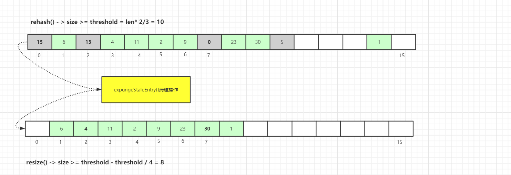
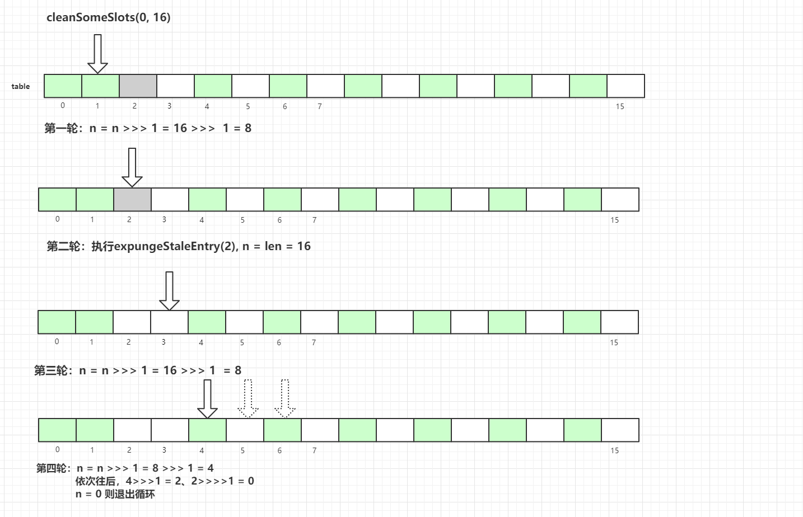
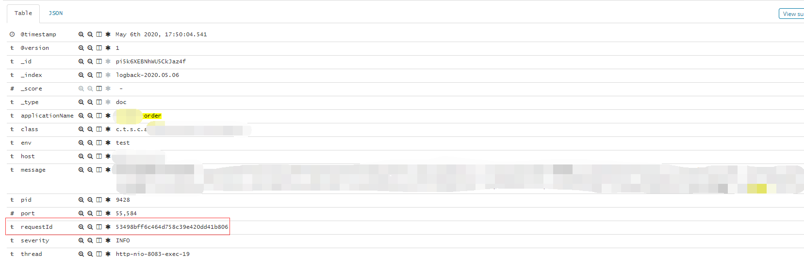
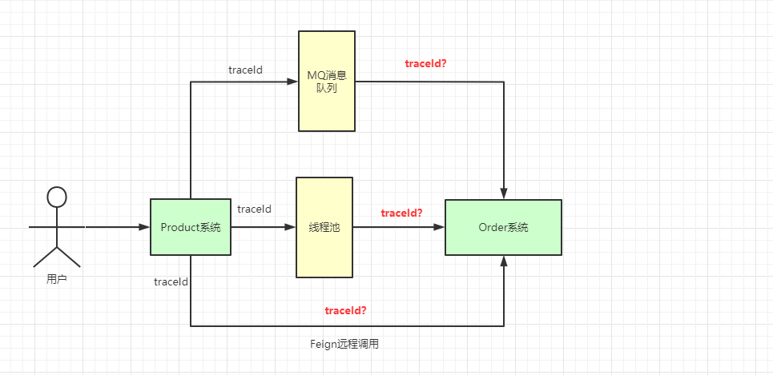

### `ThreadLocal`代码演示

我们先看下`ThreadLocal`使用示例：

```java
public class ThreadLocalTest {
    private List<String> messages = Lists.newArrayList();

    public static final `ThreadLocal`<ThreadLocalTest> holder = 	ThreadLocal.withInitial(ThreadLocalTest::new);

    public static void add(String message) {
        holder.get().messages.add(message);
    }

    public static List<String> clear() {
        List<String> messages = holder.get().messages;
        holder.remove();

        System.out.println("size: " + holder.get().messages.size());
        return messages;
    }

    public static void main(String[] args) {
        ThreadLocalTest.add("一枝花算不算浪漫");
        System.out.println(holder.get().messages);
        ThreadLocalTest.clear();
    }
}
```

打印结果：

```java
[一枝花算不算浪漫]
size: 0
```

`ThreadLocal`对象可以提供线程局部变量，每个线程`Thread`拥有一份自己的**副本变量**，多个线程互不干扰。

### `ThreadLocal`的数据结构


`Thread`类有一个类型为``ThreadLocal`.`ThreadLocalMap``的实例变量`threadLocals`，也就是说每个线程有一个自己的`ThreadLocalMap`。

`ThreadLocalMap`有自己的独立实现，可以简单地将它的`key`视作`ThreadLocal`，`value`为代码中放入的值（实际上`key`并不是`ThreadLocal`本身，而是它的一个**弱引用**）。

每个线程在往`ThreadLocal`里放值的时候，都会往自己的`ThreadLocalMap`里存，读也是以`ThreadLocal`作为引用，在自己的`map`里找对应的`key`，从而实现了**线程隔离**。

`ThreadLocalMap`有点类似`HashMap`的结构，只是`HashMap`是由**数组+链表**实现的，而`ThreadLocalMap`中并没有**链表**结构。

我们还要注意`Entry`， 它的`key`是``ThreadLocal`<?> k` ，继承自`WeakReference， 也就是我们常说的弱引用类型。

###  GC 之后key是否为null？

回应开头的那个问题， `ThreadLocal` 的`key`是弱引用，那么在` `ThreadLocal`.get()`的时候,发生`GC`之后，`key`是否是`null`？

为了搞清楚这个问题，我们需要搞清楚`Java`的**四种引用类型**：

- **强引用**：我们常常new出来的对象就是强引用类型，只要强引用存在，垃圾回收器将永远不会回收被引用的对象，哪怕内存不足的时候
- **软引用**：使用SoftReference修饰的对象被称为软引用，软引用指向的对象在内存要溢出的时候被回收
- **弱引用**：使用WeakReference修饰的对象被称为弱引用，只要发生垃圾回收，若这个对象只被弱引用指向，那么就会被回收
- **虚引用**：虚引用是最弱的引用，在 Java 中使用 PhantomReference 进行定义。虚引用中唯一的作用就是用队列接收对象即将死亡的通知


接着再来看下代码，我们使用反射的方式来看看`GC`后`ThreadLocal`中的数据情况：(下面代码来源自：https://blog.csdn.net/thewindkee/article/details/103726942，本地运行演示GC回收场景)

```java
public class ThreadLocalDemo {

    public static void main(String[] args) throws NoSuchFieldException, IllegalAccessException, InterruptedException {
        Thread t = new Thread(()->test("abc",false));
        t.start();
        t.join();
        System.out.println("--gc后--");
        Thread t2 = new Thread(() -> test("def", true));
        t2.start();
        t2.join();
    }

    private static void test(String s,boolean isGC)  {
        try {
            new `ThreadLocal`<>().set(s);
            if (isGC) {
                System.gc();
            }
            Thread t = Thread.currentThread();
            Class<? extends Thread> clz = t.getClass();
            Field field = clz.getDeclaredField("threadLocals");
            field.setAccessible(true);
            Object `ThreadLocalMap` = field.get(t);
            Class<?> tlmClass = `ThreadLocalMap`.getClass();
            Field tableField = tlmClass.getDeclaredField("table");
            tableField.setAccessible(true);
            Object[] arr = (Object[]) tableField.get(`ThreadLocalMap`);
            for (Object o : arr) {
                if (o != null) {
                    Class<?> entryClass = o.getClass();
                    Field valueField = entryClass.getDeclaredField("value");
                    Field referenceField = entryClass.getSuperclass().getSuperclass().getDeclaredField("referent");
                    valueField.setAccessible(true);
                    referenceField.setAccessible(true);
                    System.out.println(String.format("弱引用key:%s,值:%s", referenceField.get(o), valueField.get(o)));
                }
            }
        } catch (Exception e) {
            e.printStackTrace();
        }
    }
}
```

结果如下：
```java
弱引用key:java.lang.`ThreadLocal`@433619b6,值:abc
弱引用key:java.lang.`ThreadLocal`@418a15e3,值:java.lang.ref.SoftReference@bf97a12
--gc后--
弱引用key:null,值:def
```


如图所示，因为这里创建的`ThreadLocal`并没有指向任何值，也就是没有任何引用：

```java
new ThreadLocal<>().set(s);
```

所以这里在`GC`之后，`key`就会被回收，我们看到上面`debug`中的`referent=null`, 如果**改动一下代码：**


这个问题刚开始看，如果没有过多思考，**弱引用**，还有**垃圾回收**，那么肯定会觉得是`null`。

其实是不对的，因为题目说的是在做 ``ThreadLocal`.get()` 操作，证明其实还是有**强引用**存在的，所以 `key` 并不为 `null`，如下图所示，`ThreadLocal`的**强引用**仍然是存在的。


如果我们的**强引用**不存在的话，那么 `key` 就会被回收，也就是会出现我们 `value` 没被回收，`key` 被回收，导致 `value` 永远存在，出现内存泄漏。

### `ThreadLocal.set()`方法源码详解


`ThreadLocal`中的`set`方法原理如上图所示，很简单，主要是判断`ThreadLocalMap`是否存在，然后使用`ThreadLocal`中的`set`方法进行数据处理。

代码如下：

```java
public void set(T value) {
    Thread t = Thread.currentThread();
    ThreadLocalMap map = getMap(t);
    if (map != null)
        map.set(this, value);
    else
        createMap(t, value);
}

void createMap(Thread t, T firstValue) {
    t.threadLocals = new `ThreadLocalMap`(this, firstValue);
}
```

主要的核心逻辑还是在`ThreadLocalMap`中的，一步步往下看，后面还有更详细的剖析。

### `ThreadLocalMap` Hash算法

既然是`Map`结构，那么`ThreadLocalMap`当然也要实现自己的`hash`算法来解决散列表数组冲突问题。

```java
int i = key.threadLocalHashCode & (len-1);
```

`ThreadLocalMap`中`hash`算法很简单，这里`i`就是当前key在散列表中对应的数组下标位置。

这里最关键的就是`threadLocalHashCode`值的计算，`ThreadLocal`中有一个属性为`HASH_INCREMENT = 0x61c88647`

```java
public class ThreadLocal<T> {
    private final int threadLocalHashCode = nextHashCode();

    private static AtomicInteger nextHashCode = new AtomicInteger();

    private static final int HASH_INCREMENT = 0x61c88647;

    private static int nextHashCode() {
        return nextHashCode.getAndAdd(HASH_INCREMENT);
    }
    
    static class `ThreadLocalMap` {
        `ThreadLocalMap`(`ThreadLocal`<?> firstKey, Object firstValue) {
            table = new Entry[INITIAL_CAPACITY];
            int i = firstKey.threadLocalHashCode & (INITIAL_CAPACITY - 1);

            table[i] = new Entry(firstKey, firstValue);
            size = 1;
            setThreshold(INITIAL_CAPACITY);
        }
    }
}
```

每当创建一个`ThreadLocal`对象，这个``ThreadLocal`.nextHashCode` 这个值就会增长 `0x61c88647` 。

这个值很特殊，它是**斐波那契数**  也叫 **黄金分割数**。`hash`增量为 这个数字，带来的好处就是 `hash` **分布非常均匀**。

我们自己可以尝试下：


可以看到产生的哈希码分布很均匀，这里不去细纠**斐波那契**具体算法，感兴趣的可以自行查阅相关资料。

### `ThreadLocalMap` Hash冲突

> **注明：** 下面所有示例图中，**绿色块**`Entry`代表**正常数据**，**灰色块**代表`Entry`的`key`值为`null`，**已被垃圾回收**。**白色块**表示`Entry`为`null`。

虽然`ThreadLocalMap`中使用了**黄金分隔数来**作为`hash`计算因子，大大减少了`Hash`冲突的概率，但是仍然会存在冲突。

`HashMap`中解决冲突的方法是在数组上构造一个**链表**结构，冲突的数据挂载到链表上，如果链表长度超过一定数量则会转化成**红黑树**。

而`ThreadLocalMap`中并没有链表结构，所以这里不能适用`HashMap`解决冲突的方式了。


如上图所示，如果我们插入一个`value=27`的数据，通过`hash`计算后应该落入第4个槽位中，而槽位4已经有了`Entry`数据。

此时就会线性向后查找，一直找到`Entry`为`null`的槽位才会停止查找，将当前元素放入此槽位中。当然迭代过程中还有其他的情况，比如遇到了`Entry`不为`null`且`key`值相等的情况，还有`Entry`中的`key`值为`null`的情况等等都会有不同的处理，后面会一一详细讲解。

这里还画了一个`Entry`中的`key`为`null`的数据（**Entry=2的灰色块数据**），因为`key`值是**弱引用**类型，所以会有这种数据存在。在`set`过程中，如果遇到了`key`过期的`Entry`数据，实际上是会进行一轮**探测式清理**操作的，具体操作方式后面会讲到。

### `ThreadLocalMap.set()`详解

#### `ThreadLocalMap.set()`原理图解

看完了`ThreadLocal` **hash算法**后，我们再来看`set`是如何实现的。

往`ThreadLocalMap`中`set`数据（**新增**或者**更新**数据）分为好几种情况，针对不同的情况我们画图来说说明。

**第一种情况：** 通过`hash`计算后的槽位对应的`Entry`数据为空：


这里直接将数据放到该槽位即可。

**第二种情况：** 槽位数据不为空，`key`值与当前`ThreadLocal`通过`hash`计算获取的`key`值一致：


这里直接更新该槽位的数据。

**第三种情况：** 槽位数据不为空，往后遍历过程中，在找到`Entry`为`null`的槽位之前，没有遇到`key`过期的`Entry`：


遍历散列数组，线性往后查找，如果找到`Entry`为`null`的槽位，则将数据放入该槽位中，或者往后遍历过程中，遇到了**key值相等**的数据，直接更新即可。

**第四种情况：** 槽位数据不为空，往后遍历过程中，在找到`Entry`为`null`的槽位之前，遇到`key`过期的`Entry`，如下图，往后遍历过程中，一到了`index=7`的槽位数据`Entry`的`key=null`：


散列数组下标为7位置对应的`Entry`数据`key`为`null`，表明此数据`key`值已经被垃圾回收掉了，此时就会执行`replaceStaleEntry()`方法，该方法含义是**替换过期数据的逻辑**，以**index=7**位起点开始遍历，进行探测式数据清理工作。

初始化探测式清理过期数据扫描的开始位置：`slotToExpunge = staleSlot = 7`

以当前`staleSlot`开始 向前迭代查找，找其他过期的数据，然后更新过期数据起始扫描下标`slotToExpunge`。`for`循环迭代，直到碰到`Entry`为`null`结束。

如果找到了过期的数据，继续向前迭代，直到遇到`Entry=null`的槽位才停止迭代，如下图所示，**slotToExpunge被更新为0**：


以当前节点(`index=7`)向前迭代，检测是否有过期的`Entry`数据，如果有则更新`slotToExpunge`值。碰到`null`则结束探测。以上图为例`slotToExpunge`被更新为0。

上面向前迭代的操作是为了更新探测清理过期数据的起始下标`slotToExpunge`的值，这个值在后面会讲解，它是用来判断当前过期槽位`staleSlot`之前是否还有过期元素。

接着开始以`staleSlot`位置(index=7)向后迭代，**如果找到了相同key值的Entry数据：**


从当前节点`staleSlot`向后查找`key`值相等的`Entry`元素，找到后更新`Entry`的值并交换`staleSlot`元素的位置(`staleSlot`位置为过期元素)，更新`Entry`数据，然后开始进行过期`Entry`的清理工作，如下图所示：


**向后遍历过程中，如果没有找到相同key值的Entry数据：**


从当前节点`staleSlot`向后查找`key`值相等的`Entry`元素，直到`Entry`为`null`则停止寻找。通过上图可知，此时`table`中没有`key`值相同的`Entry`。

创建新的`Entry`，替换`table[stableSlot]`位置：


替换完成后也是进行过期元素清理工作，清理工作主要是有两个方法：`expungeStaleEntry()`和`cleanSomeSlots()`，具体细节后面会讲到，请继续往后看。

#### `ThreadLocalMap.set()`源码详解

上面已经用图的方式解析了`set()`实现的原理，其实已经很清晰了，我们接着再看下源码：

`java.lang.ThreadLocal`.`ThreadLocalMap.set()`:

```java
private void set(ThreadLocal<?> key, Object value) {
    Entry[] tab = table;
    int len = tab.length;
    int i = key.threadLocalHashCode & (len-1);

    for (Entry e = tab[i];
         e != null;
         e = tab[i = nextIndex(i, len)]) {
        `ThreadLocal`<?> k = e.get();

        if (k == key) {
            e.value = value;
            return;
        }

        if (k == null) {
            replaceStaleEntry(key, value, i);
            return;
        }
    }

    tab[i] = new Entry(key, value);
    int sz = ++size;
    if (!cleanSomeSlots(i, sz) && sz >= threshold)
        rehash();
}
```

这里会通过`key`来计算在散列表中的对应位置，然后以当前`key`对应的桶的位置向后查找，找到可以使用的桶。

```java
Entry[] tab = table;
int len = tab.length;
int i = key.threadLocalHashCode & (len-1);
```

什么情况下桶才是可以使用的呢？
1. `k = key` 说明是替换操作，可以使用
2. 碰到一个过期的桶，执行替换逻辑，占用过期桶
3. 查找过程中，碰到桶中`Entry=null`的情况，直接使用

接着就是执行`for`循环遍历，向后查找，我们先看下`nextIndex()`、`prevIndex()`方法实现：


```java
private static int nextIndex(int i, int len) {
    return ((i + 1 < len) ? i + 1 : 0);
}

private static int prevIndex(int i, int len) {
    return ((i - 1 >= 0) ? i - 1 : len - 1);
}
```

接着看剩下`for`循环中的逻辑：
1. 遍历当前`key`值对应的桶中`Entry`数据为空，这说明散列数组这里没有数据冲突，跳出`for`循环，直接`set`数据到对应的桶中
2. 如果`key`值对应的桶中`Entry`数据不为空
2.1 如果`k = key`，说明当前`set`操作是一个替换操作，做替换逻辑，直接返回
2.2 如果`key = null`，说明当前桶位置的`Entry`是过期数据，执行`replaceStaleEntry()`方法(核心方法)，然后返回
3. `for`循环执行完毕，继续往下执行说明向后迭代的过程中遇到了`entry`为`null`的情况
3.1 在`Entry`为`null`的桶中创建一个新的`Entry`对象
3.2 执行`++size`操作
4. 调用`cleanSomeSlots()`做一次启发式清理工作，清理散列数组中`Entry`的`key`过期的数据
4.1 如果清理工作完成后，未清理到任何数据，且`size`超过了阈值(数组长度的2/3)，进行`rehash()`操作
4.2 `rehash()`中会先进行一轮探测式清理，清理过期`key`，清理完成后如果**size >= threshold - threshold / 4**，就会执行真正的扩容逻辑(扩容逻辑往后看)

接着重点看下`replaceStaleEntry()`方法，`replaceStaleEntry()`方法提供替换过期数据的功能，我们可以对应上面**第四种情况**的原理图来再回顾下，具体代码如下：

`java.lang.ThreadLocal.ThreadLocalMap.replaceStaleEntry()`:

```java
private void replaceStaleEntry(`ThreadLocal`<?> key, Object value,
                                       int staleSlot) {
    Entry[] tab = table;
    int len = tab.length;
    Entry e;

    int slotToExpunge = staleSlot;
    for (int i = prevIndex(staleSlot, len);
         (e = tab[i]) != null;
         i = prevIndex(i, len))

        if (e.get() == null)
            slotToExpunge = i;

    for (int i = nextIndex(staleSlot, len);
         (e = tab[i]) != null;
         i = nextIndex(i, len)) {

        `ThreadLocal`<?> k = e.get();

        if (k == key) {
            e.value = value;

            tab[i] = tab[staleSlot];
            tab[staleSlot] = e;

            if (slotToExpunge == staleSlot)
                slotToExpunge = i;
            cleanSomeSlots(expungeStaleEntry(slotToExpunge), len);
            return;
        }

        if (k == null && slotToExpunge == staleSlot)
            slotToExpunge = i;
    }

    tab[staleSlot].value = null;
    tab[staleSlot] = new Entry(key, value);

    if (slotToExpunge != staleSlot)
        cleanSomeSlots(expungeStaleEntry(slotToExpunge), len);
}
```

`slotToExpunge`表示开始探测式清理过期数据的开始下标，默认从当前的`staleSlot`开始。以当前的`staleSlot`开始，向前迭代查找，找到没有过期的数据，`for`循环一直碰到`Entry`为`null`才会结束。如果向前找到了过期数据，更新探测清理过期数据的开始下标为i，即`slotToExpunge=i`

```java
for (int i = prevIndex(staleSlot, len);
     (e = tab[i]) != null;
     i = prevIndex(i, len)){

    if (e.get() == null){
        slotToExpunge = i;
    }
}
```

接着开始从`staleSlot`向后查找，也是碰到`Entry`为`null`的桶结束。
如果迭代过程中，**碰到k == key**，这说明这里是替换逻辑，替换新数据并且交换当前`staleSlot`位置。如果`slotToExpunge == staleSlot`，这说明`replaceStaleEntry()`一开始向前查找过期数据时并未找到过期的`Entry`数据，接着向后查找过程中也未发现过期数据，修改开始探测式清理过期数据的下标为当前循环的index，即`slotToExpunge = i`。最后调用`cleanSomeSlots(expungeStaleEntry(slotToExpunge), len);`进行启发式过期数据清理。

```java
if (k == key) {
    e.value = value;

    tab[i] = tab[staleSlot];
    tab[staleSlot] = e;
 
    if (slotToExpunge == staleSlot)
        slotToExpunge = i;

    cleanSomeSlots(expungeStaleEntry(slotToExpunge), len);
    return;
}
```

`cleanSomeSlots()`和`expungeStaleEntry()`方法后面都会细讲，这两个是和清理相关的方法，一个是过期`key`相关`Entry`的启发式清理(`Heuristically scan`)，另一个是过期`key`相关`Entry`的探测式清理。

**如果k != key**则会接着往下走，`k == null`说明当前遍历的`Entry`是一个过期数据，`slotToExpunge == staleSlot`说明，一开始的向前查找数据并未找到过期的`Entry`。如果条件成立，则更新`slotToExpunge` 为当前位置，这个前提是前驱节点扫描时未发现过期数据。

```java
if (k == null && slotToExpunge == staleSlot)
    slotToExpunge = i;
```

往后迭代的过程中如果没有找到`k == key`的数据，且碰到`Entry`为`null`的数据，则结束当前的迭代操作。此时说明这里是一个添加的逻辑，将新的数据添加到`table[staleSlot]` 对应的`slot`中。

```java
tab[staleSlot].value = null;
tab[staleSlot] = new Entry(key, value);
```

最后判断除了`staleSlot`以外，还发现了其他过期的`slot`数据，就要开启清理数据的逻辑：
```java
if (slotToExpunge != staleSlot)
    cleanSomeSlots(expungeStaleEntry(slotToExpunge), len);
```

### `ThreadLocalMap`过期key的探测式清理流程

上面我们有提及`ThreadLocalMap`的两种过期`key`数据清理方式：**探测式清理**和**启发式清理**。

我们先讲下探测式清理，也就是`expungeStaleEntry`方法，遍历散列数组，从开始位置向后探测清理过期数据，将过期数据的`Entry`设置为`null`，沿途中碰到未过期的数据则将此数据`rehash`后重新在`table`数组中定位，如果定位的位置已经有了数据，则会将未过期的数据放到最靠近此位置的`Entry=null`的桶中，使`rehash`后的`Entry`数据距离正确的桶的位置更近一些。操作逻辑如下：


如上图，`set(27)` 经过hash计算后应该落到`index=4`的桶中，由于`index=4`桶已经有了数据，所以往后迭代最终数据放入到`index=7`的桶中，放入后一段时间后`index=5`中的`Entry`数据`key`变为了`null`


如果再有其他数据`set`到`map`中，就会触发**探测式清理**操作。

如上图，执行**探测式清理**后，`index=5`的数据被清理掉，继续往后迭代，到`index=7`的元素时，经过`rehash`后发现该元素正确的`index=4`，而此位置已经已经有了数据，往后查找离`index=4`最近的`Entry=null`的节点(刚被探测式清理掉的数据：index=5)，找到后移动`index= 7`的数据到`index=5`中，此时桶的位置离正确的位置`index=4`更近了。

经过一轮探测式清理后，`key`过期的数据会被清理掉，没过期的数据经过`rehash`重定位后所处的桶位置理论上更接近`i= key.hashCode & (tab.len - 1)`的位置。这种优化会提高整个散列表查询性能。

接着看下`expungeStaleEntry()`具体流程，我们还是以先原理图后源码讲解的方式来一步步梳理：


我们假设`expungeStaleEntry(3)` 来调用此方法，如上图所示，我们可以看到`ThreadLocalMap`中`table`的数据情况，接着执行清理操作：


第一步是清空当前`staleSlot`位置的数据，`index=3`位置的`Entry`变成了`null`。然后接着往后探测：


执行完第二步后，index=4的元素挪到index=3的槽位中。

继续往后迭代检查，碰到正常数据，计算该数据位置是否偏移，如果被偏移，则重新计算`slot`位置，目的是让正常数据尽可能存放在正确位置或离正确位置更近的位置


在往后迭代的过程中碰到空的槽位，终止探测，这样一轮探测式清理工作就完成了，接着我们继续看看具体**实现源代码**：

```java
private int expungeStaleEntry(int staleSlot) {
    Entry[] tab = table;
    int len = tab.length;

    tab[staleSlot].value = null;
    tab[staleSlot] = null;
    size--;

    Entry e;
    int i;
    for (i = nextIndex(staleSlot, len);
         (e = tab[i]) != null;
         i = nextIndex(i, len)) {
        `ThreadLocal`<?> k = e.get();
        if (k == null) {
            e.value = null;
            tab[i] = null;
            size--;
        } else {
            int h = k.threadLocalHashCode & (len - 1);
            if (h != i) {
                tab[i] = null;

                while (tab[h] != null)
                    h = nextIndex(h, len);
                tab[h] = e;
            }
        }
    }
    return i;
}
```

这里我们还是以`staleSlot=3` 来做示例说明，首先是将`tab[staleSlot]`槽位的数据清空，然后设置`size--`
接着以`staleSlot`位置往后迭代，如果遇到`k==null`的过期数据，也是清空该槽位数据，然后`size--`

```java
ThreadLocal<?> k = e.get();

if (k == null) {
    e.value = null;
    tab[i] = null;
    size--;
} 
```

如果`key`没有过期，重新计算当前`key`的下标位置是不是当前槽位下标位置，如果不是，那么说明产生了`hash`冲突，此时以新计算出来正确的槽位位置往后迭代，找到最近一个可以存放`entry`的位置。

```java
int h = k.threadLocalHashCode & (len - 1);
if (h != i) {
    tab[i] = null;

    while (tab[h] != null)
        h = nextIndex(h, len);

    tab[h] = e;
}
```

这里是处理正常的产生`Hash`冲突的数据，经过迭代后，有过`Hash`冲突数据的`Entry`位置会更靠近正确位置，这样的话，查询的时候 效率才会更高。

### `ThreadLocalMap`扩容机制

在``ThreadLocalMap.set()`方法的最后，如果执行完启发式清理工作后，未清理到任何数据，且当前散列数组中`Entry`的数量已经达到了列表的扩容阈值`(len*2/3)`，就开始执行`rehash()`逻辑：

```java
if (!cleanSomeSlots(i, sz) && sz >= threshold)
    rehash();
```

接着看下`rehash()`具体实现：

```java
private void rehash() {
    expungeStaleEntries();

    if (size >= threshold - threshold / 4)
        resize();
}

private void expungeStaleEntries() {
    Entry[] tab = table;
    int len = tab.length;
    for (int j = 0; j < len; j++) {
        Entry e = tab[j];
        if (e != null && e.get() == null)
            expungeStaleEntry(j);
    }
}
```

这里首先是会进行探测式清理工作，从`table`的起始位置往后清理，上面有分析清理的详细流程。清理完成之后，`table`中可能有一些`key`为`null`的`Entry`数据被清理掉，所以此时通过判断`size >= threshold - threshold / 4` 也就是`size >= threshold* 3/4` 来决定是否扩容。

我们还记得上面进行`rehash()`的阈值是`size >= threshold`，所以当面试官套路我们`ThreadLocalMap`扩容机制的时候 我们一定要说清楚这两个步骤：



接着看看具体的`resize()`方法，为了方便演示，我们以`oldTab.len=8`来举例：


扩容后的`tab`的大小为`oldLen * 2`，然后遍历老的散列表，重新计算`hash`位置，然后放到新的`tab`数组中，如果出现`hash`冲突则往后寻找最近的`entry`为`null`的槽位，遍历完成之后，`oldTab`中所有的`entry`数据都已经放入到新的`tab`中了。重新计算`tab`下次扩容的**阈值**，具体代码如下：

```java
private void resize() {
    Entry[] oldTab = table;
    int oldLen = oldTab.length;
    int newLen = oldLen * 2;
    Entry[] newTab = new Entry[newLen];
    int count = 0;

    for (int j = 0; j < oldLen; ++j) {
        Entry e = oldTab[j];
        if (e != null) {
            `ThreadLocal`<?> k = e.get();
            if (k == null) {
                e.value = null;
            } else {
                int h = k.threadLocalHashCode & (newLen - 1);
                while (newTab[h] != null)
                    h = nextIndex(h, newLen);
                newTab[h] = e;
                count++;
            }
        }
    }

    setThreshold(newLen);
    size = count;
    table = newTab;
}
```

### `ThreadLocalMap.get()`详解

上面已经看完了`set()`方法的源码，其中包括`set`数据、清理数据、优化数据桶的位置等操作，接着看看`get()`操作的原理。

#### `ThreadLocalMap.get()`图解

**第一种情况：** 通过查找`key`值计算出散列表中`slot`位置，然后该`slot`位置中的`Entry.key`和查找的`key`一致，则直接返回：


**第二种情况：** `slot`位置中的`Entry.key`和要查找的`key`不一致：


我们以`get(ThreadLocal1)`为例，通过`hash`计算后，正确的`slot`位置应该是4，而`index=4`的槽位已经有了数据，且`key`值不等于``ThreadLocal`1`，所以需要继续往后迭代查找。

迭代到`index=5`的数据时，此时`Entry.key=null`，触发一次探测式数据回收操作，执行`expungeStaleEntry()`方法，执行完后，`index 5,8`的数据都会被回收，而`index 6,7`的数据都会前移，此时继续往后迭代，到`index = 6`的时候即找到了`key`值相等的`Entry`数据，如下图所示：


#### `ThreadLocalMap.get()`源码详解

`java.lang.ThreadLocal.ThreadLocalMap.getEntry()`:

```java
private Entry getEntry(`ThreadLocal`<?> key) {
    int i = key.threadLocalHashCode & (table.length - 1);
    Entry e = table[i];
    if (e != null && e.get() == key)
        return e;
    else
        return getEntryAfterMiss(key, i, e);
}

private Entry getEntryAfterMiss(`ThreadLocal`<?> key, int i, Entry e) {
    Entry[] tab = table;
    int len = tab.length;

    while (e != null) {
        `ThreadLocal`<?> k = e.get();
        if (k == key)
            return e;
        if (k == null)
            expungeStaleEntry(i);
        else
            i = nextIndex(i, len);
        e = tab[i];
    }
    return null;
}
```


### `ThreadLocalMap`过期key的启发式清理流程


上面多次提及到`ThreadLocalMap`过期可以的两种清理方式：**探测式清理(expungeStaleEntry())**、**启发式清理(cleanSomeSlots())**

探测式清理是以当前`Entry` 往后清理，遇到值为`null`则结束清理，属于**线性探测清理**。

而启发式清理被作者定义为：**Heuristically scan some cells looking for stale entries**.



具体代码如下：

```java
private boolean cleanSomeSlots(int i, int n) {
    boolean removed = false;
    Entry[] tab = table;
    int len = tab.length;
    do {
        i = nextIndex(i, len);
        Entry e = tab[i];
        if (e != null && e.get() == null) {
            n = len;
            removed = true;
            i = expungeStaleEntry(i);
        }
    } while ( (n >>>= 1) != 0);
    return removed;
}
```

### `InheritableThreadLocal`

我们使用`ThreadLocal`的时候，在异步场景下是无法给子线程共享父线程中创建的线程副本数据的。

为了解决这个问题，JDK中还有一个`InheritableThreadLocal`类，我们来看一个例子：

```java
public class InheritableThreadLocalDemo {
    public static void main(String[] args) {
        ThreadLocal<String> ThreadLocal = new ThreadLocal<>();
        ThreadLocal<String> inheritableThreadLocal = new InheritableThreadLocal<>();
        ThreadLocal.set("父类数据:threadLocal");
        inheritableThreadLocal.set("父类数据:inheritableThreadLocal");

        new Thread(new Runnable() {
            @Override
            public void run() {
                System.out.println("子线程获取父类`ThreadLocal`数据：" + `ThreadLocal`.get());
                System.out.println("子线程获取父类inheritableThreadLocal数据：" + inheritableThreadLocal.get());
            }
        }).start();
    }
}
```

打印结果：

```java
子线程获取父类`ThreadLocal`数据：null
子线程获取父类inheritableThreadLocal数据：父类数据:inheritableThreadLocal
```

实现原理是子线程是通过在父线程中通过调用`new Thread()`方法来创建子线程，`Thread#init`方法在`Thread`的构造方法中被调用。在`init`方法中拷贝父线程数据到子线程中：

```java
private void init(ThreadGroup g, Runnable target, String name,
                      long stackSize, AccessControlContext acc,
                      boolean inheritThreadLocals) {
    if (name == null) {
        throw new NullPointerException("name cannot be null");
    }

    if (inheritThreadLocals && parent.inheritableThreadLocals != null)
        this.inheritableThreadLocals =
            ThreadLocal.createInheritedMap(parent.inheritableThreadLocals);
    this.stackSize = stackSize;
    tid = nextThreadID();
}
```

但`InheritableThreadLocal`仍然有缺陷，一般我们做异步化处理都是使用的线程池，而`InheritableThreadLocal`是在`new Thread`中的`init()`方法给赋值的，而线程池是线程复用的逻辑，所以这里会存在问题。

当然，有问题出现就会有解决问题的方案，阿里巴巴开源了一个`TransmittableThreadLocal`组件就可以解决这个问题，这里就不再延伸，感兴趣的可自行查阅资料。

### `ThreadLocal`项目中使用实战

#### `ThreadLocal`使用场景

我们现在项目中日志记录用的是`ELK+Logstash`，最后在`Kibana`中进行展示和检索。

现在都是分布式系统统一对外提供服务，项目间调用的关系可以通过traceId来关联，但是不同项目之间如何传递`traceId`呢？

这里我们使用`org.slf4j.MDC`来实现此功能，内部就是通过`ThreadLocal`来实现的，具体实现如下：

当前端发送请求到**服务A**时，**服务A**会生成一个类似`UUID`的`traceId`字符串，将此字符串放入当前线程的`ThreadLocal`中，在调用**服务B**的时候，将`traceId`写入到请求的`Header`中，**服务B**在接收请求时会先判断请求的`Header`中是否有`traceId`，如果存在则写入自己线程的`ThreadLocal`中。



图中的`requestId`即为我们各个系统链路关联的`traceId`，系统间互相调用，通过这个`requestId`即可找到对应链路，这里还有会有一些其他场景：



针对于这些场景，我们都可以有相应的解决方案，如下所示

#### Feign远程调用解决方案

**服务发送请求：**
```java
@Component
@Slf4j
public class FeignInvokeInterceptor implements RequestInterceptor {

    @Override
    public void apply(RequestTemplate template) {
        String requestId = MDC.get("requestId");
        if (StringUtils.isNotBlank(requestId)) {
            template.header("requestId", requestId);
        }
    }
}
```

**服务接收请求：**
```java
@Slf4j
@Component
public class LogInterceptor extends HandlerInterceptorAdapter {

    @Override
    public void afterCompletion(HttpServletRequest arg0, HttpServletResponse arg1, Object arg2, Exception arg3) {
        MDC.remove("requestId");
    }

    @Override
    public void postHandle(HttpServletRequest arg0, HttpServletResponse arg1, Object arg2, ModelAndView arg3) {
    }

    @Override
    public boolean preHandle(HttpServletRequest request, HttpServletResponse response, Object handler) throws Exception {

        String requestId = request.getHeader(BaseConstant.REQUEST_ID_KEY);
        if (StringUtils.isBlank(requestId)) {
            requestId = UUID.randomUUID().toString().replace("-", "");
        }
        MDC.put("requestId", requestId);
        return true;
    }
}
```

#### 线程池异步调用，requestId传递

因为`MDC`是基于`ThreadLocal`去实现的，异步过程中，子线程并没有办法获取到父线程`ThreadLocal`存储的数据，所以这里可以自定义线程池执行器，修改其中的`run()`方法：

```java
public class MyThreadPoolTaskExecutor extends ThreadPoolTaskExecutor {
    
    @Override
    public void execute(Runnable runnable) {
        Map<String, String> context = MDC.getCopyOfContextMap();
        super.execute(() -> run(runnable, context));
    }

    @Override
    private void run(Runnable runnable, Map<String, String> context) {
        if (context != null) {
            MDC.setContextMap(context);
        }
        try {
            runnable.run();
        } finally {
            MDC.remove();
        }
    }
}
```

#### 使用MQ发送消息给第三方系统

在MQ发送的消息体中自定义属性`requestId`，接收方消费消息后，自己解析`requestId`使用即可。


## 参考

[【深入AQS原理】我画了35张图就是为了让你深入 AQS](https://juejin.im/post/6844904146127044622)

