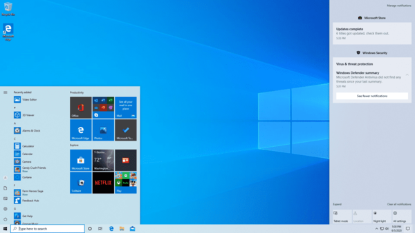
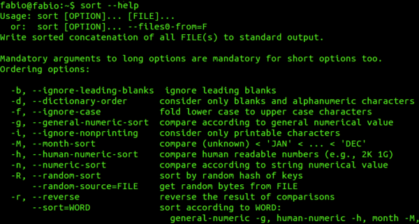
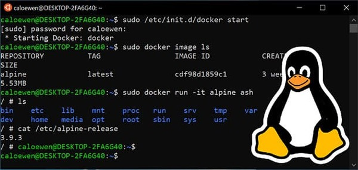
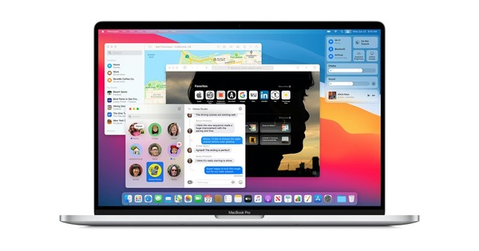
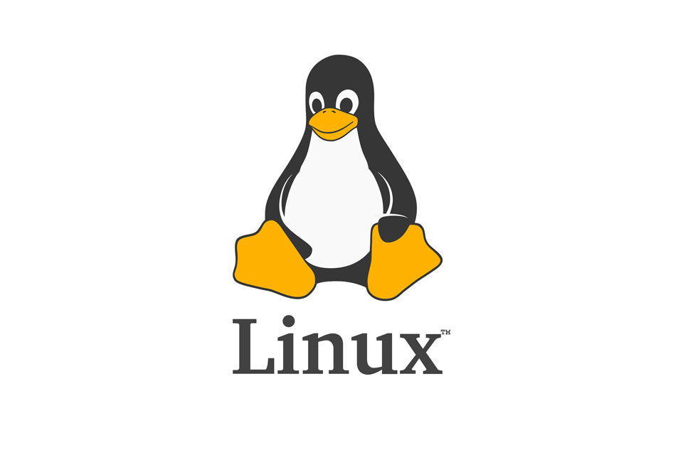
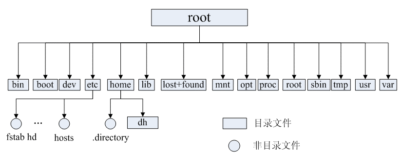

## 1. 从认识操作系统开始

正式开始 Linux 之前，简单花一点点篇幅科普一下操作系统相关的内容。

### 1.1. 操作系统简介

我通过以下四点介绍什么是操作系统：

1. **操作系统（Operating System，简称 OS）是管理计算机硬件与软件资源的程序，是计算机的基石。**
2. **操作系统本质上是一个运行在计算机上的软件程序 ，用于管理计算机硬件和软件资源。** 举例：运行在你电脑上的所有应用程序都通过操作系统来调用系统内存以及磁盘等等硬件。
3. **操作系统存在屏蔽了硬件层的复杂性。** 操作系统就像是硬件使用的负责人，统筹着各种相关事项。
4. **操作系统的内核（Kernel）是操作系统的核心部分，它负责系统的内存管理，硬件设备的管理，文件系统的管理以及应用程序的管理**。

> 内核（Kernel）在后文中会提到。

### 1.2. 操作系统简单分类

#### 1.2.1. Windows

目前最流行的个人桌面操作系统 ，不做多的介绍，大家都清楚。界面简单易操作，软件生态非常好。

_玩玩电脑游戏还是必须要有 Windows 的，所以我现在是一台 Windows 用于玩游戏，一台 Mac 用于平时日常开发和学习使用。_

#### 1.2.2. Unix

最早的多用户、多任务操作系统 。后面崛起的 Linux 在很多方面都参考了 Unix。

目前这款操作系统已经逐渐逐渐退出操作系统的舞台。

#### 1.2.3. Linux

**Linux 是一套免费使用、开源的类 Unix 操作系统。** Linux 存在着许多不同的发行版本，但它们都使用了 **Linux 内核** 。

> 严格来讲，Linux 这个词本身只表示 Linux 内核，在 GNU/Linux 系统中，Linux 实际就是 Linux 内核，而该系统的其余部分主要是由 GNU 工程编写和提供的程序组成。单独的 Linux 内核并不能成为一个可以正常工作的操作系统。
>
> **很多人更倾向使用 “GNU/Linux” 一词来表达人们通常所说的 “Linux”。**

#### 1.2.4. Mac OS

苹果自家的操作系统，编程体验和 Linux 相当，但是界面、软件生态以及用户体验各方面都要比 Linux 操作系统更好。

### 1.3. 操作系统的内核（Kernel）

我们先来看看维基百科对于内核的解释，我觉得总结的非常好！

> **内核**（英语：Kernel，又称核心）在计算机科学中是一个用来管理软件发出的数据 I/O（输入与输出）要求的电脑程序，将这些要求转译为数据处理的指令并交由中央处理器（CPU）及电脑中其他电子组件进行处理，是现代操作系统中最基本的部分。它是为众多应用程序提供对计算机硬件的安全访问的一部分软件，这种访问是有限的，并由内核决定一个程序在什么时候对某部分硬件操作多长时间。 **直接对硬件操作是非常复杂的。所以内核通常提供一种硬件抽象的方法，来完成这些操作。有了这个，通过进程间通信机制及系统调用，应用进程可间接控制所需的硬件资源（特别是处理器及 IO 设备）。**
>
> 早期计算机系统的设计中，还没有操作系统的内核这个概念。随着计算机系统的发展，操作系统内核的概念才渐渐明晰起来了!

简单概括两点：

1. **操作系统的内核（Kernel）是操作系统的核心部分，它负责系统的内存管理，硬件设备的管理，文件系统的管理以及应用程序的管理。**
2. **操作系统的内核是连接应用程序和硬件的桥梁，决定着操作系统的性能和稳定性。**

### 1.4. 中央处理器（CPU，Central Processing Unit）

关于 CPU 简单概括三点：

1. **CPU 是一台计算机的运算核心（Core）+控制核心（ Control Unit），可以称得上是计算机的大脑。**
2. **CPU 主要包括两个部分：控制器+运算器。**
3. **CPU 的根本任务就是执行指令，对计算机来说最终都是一串由“0”和“1”组成的序列。**

### 1.5. CPU vs Kernel(内核)

很多人容易无法区分操作系统的内核（Kernel）和中央处理器（CPU），你可以简单从下面两点来区别：

1. 操作系统的内核（Kernel）属于操作系统层面，而 CPU 属于硬件。
2. CPU 主要提供运算，处理各种指令的能力。内核（Kernel）主要负责系统管理比如内存管理，它屏蔽了对硬件的操作。

下图清晰说明了应用程序、内核、CPU 这三者的关系。

### 1.6. 系统调用

介绍系统调用之前，我们先来了解一下用户态和系统态。

根据进程访问资源的特点，我们可以把进程在系统上的运行分为两个级别：

1. **用户态(user mode)** : 用户态运行的进程或可以直接读取用户程序的数据。
2. **系统态(kernel mode)**: 可以简单的理解系统态运行的进程或程序几乎可以访问计算机的任何资源，不受限制。

**说了用户态和系统态之后，那么什么是系统调用呢？**

我们运行的程序基本都是运行在用户态，如果我们调用操作系统提供的系统态级别的子功能咋办呢？那就需要系统调用了！

也就是说在我们运行的用户程序中，凡是与系统态级别的资源有关的操作（如文件管理、进程控制、内存管理等)，都必须通过系统调用方式向操作系统提出服务请求，并由操作系统代为完成。

这些系统调用按功能大致可分为如下几类：

- **设备管理** ：完成设备的请求或释放，以及设备启动等功能。
- **文件管理** ：完成文件的读、写、创建及删除等功能。
- **进程控制** ：完成进程的创建、撤销、阻塞及唤醒等功能。
- **进程通信** ：完成进程之间的消息传递或信号传递等功能。
- **内存管理** ：完成内存的分配、回收以及获取作业占用内存区大小及地址等功能。

我在网上找了一个图，通过这个图可以很清晰的说明用户程序、系统调用、内核和硬件之间的关系。（_太难了~木有自己画_）

## 2. 初探 Linux

### 2.1. Linux 简介

我们上面已经简单了 Linux，这里只强调三点。

- **类 Unix 系统** ： Linux 是一种自由、开放源码的类似 Unix 的操作系统
- **Linux 本质是指 Linux 内核** ： 严格来讲，Linux 这个词本身只表示 Linux 内核，单独的 Linux 内核并不能成为一个可以正常工作的操作系统。所以，就有了各种 Linux 发行版。
- **Linux 之父** ： 一个编程领域的传奇式人物，真大佬！我辈崇拜敬仰之楷模。他是 **Linux 内核** 的最早作者，随后发起了这个开源项目，担任 Linux 内核的首要架构师。他还发起了 Git 这个开源项目，并为主要的开发者。

### 2.2. Linux 诞生

1989 年，Linus Torvalds 进入芬兰陆军新地区旅，服 11 个月的国家义务兵役，军衔为少尉，主要服务于计算机部门，任务是弹道计算。服役期间，购买了安德鲁·斯图尔特·塔能鲍姆所著的教科书及 minix 源代码，开始研究操作系统。1990 年，他退伍后回到大学，开始接触 Unix。

> **Minix** 是一个迷你版本的类 Unix 操作系统，由塔能鲍姆教授为了教学之用而创作，采用微核心设计。它启发了 Linux 内核的创作。

1991 年，Linus Torvalds 开源了 Linux 内核。Linux 以一只可爱的企鹅作为标志，象征着敢作敢为、热爱生活。

### 2.3. 常见 Linux 发行版本有哪些？

Linus Torvalds 开源的只是 Linux 内核，我们上面也提到了操作系统内核的作用。一些组织或厂商将 Linux 内核与各种软件和文档包装起来，并提供系统安装界面和系统配置、设定与管理工具，就构成了 Linux 的发行版本。

> 内核主要负责系统的内存管理，硬件设备的管理，文件系统的管理以及应用程序的管理。

Linux 的发行版本可以大体分为两类：

- 商业公司维护的发行版本，以著名的 Red Hat 为代表，比较典型的有 CentOS 。
- 社区组织维护的发行版本，以 Debian 为代表，比较典型的有 Ubuntu、Debian。

对于初学者学习 Linux ,推荐选择 CentOS 。

## 3. Linux 文件系统概览

### 3.1. Linux 文件系统简介

**在 Linux 操作系统中，所有被操作系统管理的资源，例如网络接口卡、磁盘驱动器、打印机、输入输出设备、普通文件或是目录都被看作是一个文件。** 也就是说在 Linux 系统中有一个重要的概念：**一切都是文件**。

其实这是 UNIX 哲学的一个体现，在 UNIX 系统中，把一切资源都看作是文件，Linux 的文件系统也是借鉴 UNIX 文件系统而来。

### 3.2. inode 介绍

**inode 是 linux/unix 文件系统的基础。那么，inode 是什么?有什么作用呢?**

硬盘的最小存储单位是扇区(Sector)，块(block)由多个扇区组成。文件数据存储在块中。块的最常见的大小是 4kb，约为 8 个连续的扇区组成（每个扇区存储 512 字节）。一个文件可能会占用多个 block，但是一个块只能存放一个文件。

虽然，我们将文件存储在了块(block)中，但是我们还需要一个空间来存储文件的 **元信息 metadata** ：如某个文件被分成几块、每一块在的地址、文件拥有者，创建时间，权限，大小等。这种 **存储文件元信息的区域就叫 inode**，译为索引节点：**i（index）+node**。 每个文件都有一个 inode，存储文件的元信息。

可以使用 `stat` 命令可以查看文件的 inode 信息。每个 inode 都有一个号码，Linux/Unix 操作系统不使用文件名来区分文件，而是使用 inode 号码区分不同的文件。

简单来说：inode 就是用来维护某个文件被分成几块、每一块在的地址、文件拥有者，创建时间，权限，大小等信息。

简单总结一下：

- **inode** ：记录文件的属性信息，可以使用 stat 命令查看 inode 信息。
- **block** ：实际文件的内容，如果一个文件大于一个块时候，那么将占用多个 block，但是一个块只能存放一个文件。（因为数据是由 inode 指向的，如果有两个文件的数据存放在同一个块中，就会乱套了）

### 3.3. Linux 文件类型

Linux 支持很多文件类型，其中非常重要的文件类型有: **普通文件**，**目录文件**，**链接文件**，**设备文件**，**管道文件**，**Socket 套接字文件**等。

- **普通文件（-）** ： 用于存储信息和数据， Linux 用户可以根据访问权限对普通文件进行查看、更改和删除。比如：图片、声音、PDF、text、视频、源代码等等。
- **目录文件（d，directory file）** ：目录也是文件的一种，用于表示和管理系统中的文件，目录文件中包含一些文件名和子目录名。打开目录事实上就是打开目录文件。
- **符号链接文件（l，symbolic link）** ：保留了指向文件的地址而不是文件本身。
- **字符设备（c，char）** ：用来访问字符设备比如硬盘。
- **设备文件（b，block）** ： 用来访问块设备比如硬盘、软盘。
- **管道文件(p,pipe)** : 一种特殊类型的文件，用于进程之间的通信。
- **套接字(s,socket)** ：用于进程间的网络通信，也可以用于本机之间的非网络通信。

### 3.4. Linux 目录树

所有可操作的计算机资源都存在于目录树这个结构中，对计算资源的访问，可以看做是对这棵目录树的访问。

**Linux 的目录结构如下：**

Linux 文件系统的结构层次鲜明，就像一棵倒立的树，最顶层是其根目录：

**常见目录说明：**

- **/bin：** 存放二进制可执行文件(ls、cat、mkdir 等)，常用命令一般都在这里；
- **/etc：** 存放系统管理和配置文件；
- **/home：** 存放所有用户文件的根目录，是用户主目录的基点，比如用户 user 的主目录就是/home/user，可以用~user 表示；
- **/usr ：** 用于存放系统应用程序；
- **/opt：** 额外安装的可选应用程序包所放置的位置。一般情况下，我们可以把 tomcat 等都安装到这里；
- **/proc：** 虚拟文件系统目录，是系统内存的映射。可直接访问这个目录来获取系统信息；
- **/root：** 超级用户（系统管理员）的主目录（特权阶级^o^）；
- **/sbin:** 存放二进制可执行文件，只有 root 才能访问。这里存放的是系统管理员使用的系统级别的管理命令和程序。如 ifconfig 等；
- **/dev：** 用于存放设备文件；
- **/mnt：** 系统管理员安装临时文件系统的安装点，系统提供这个目录是让用户临时挂载其他的文件系统；
- **/boot：** 存放用于系统引导时使用的各种文件；
- **/lib ：** 存放着和系统运行相关的库文件 ；
- **/tmp：** 用于存放各种临时文件，是公用的临时文件存储点；
- **/var：** 用于存放运行时需要改变数据的文件，也是某些大文件的溢出区，比方说各种服务的日志文件（系统启动日志等。）等；
- **/lost+found：** 这个目录平时是空的，系统非正常关机而留下“无家可归”的文件（windows 下叫什么.chk）就在这里。

## 4. Linux 基本命令

下面只是给出了一些比较常用的命令。推荐一个 Linux 命令快查网站，非常不错，大家如果遗忘某些命令或者对某些命令不理解都可以在这里得到解决。

Linux 命令大全：[http://man.linuxde.net/](http://man.linuxde.net/)

### 4.1. 目录切换命令

- **`cd usr`：** 切换到该目录下 usr 目录
- **`cd ..（或cd../）`：** 切换到上一层目录
- **`cd /`：** 切换到系统根目录
- **`cd ~`：** 切换到用户主目录
- **`cd -`：** 切换到上一个操作所在目录

### 4.2. 目录的操作命令(增删改查)

- **`mkdir 目录名称`：** 增加目录。
- **`ls/ll`**（ll 是 ls -l 的别名，ll 命令可以看到该目录下的所有目录和文件的详细信息）：查看目录信息。
- **`find 目录 参数`：** 寻找目录（查）。示例：① 列出当前目录及子目录下所有文件和文件夹: `find .`；② 在`/home`目录下查找以.txt 结尾的文件名:`find /home -name "*.txt"` ,忽略大小写: `find /home -iname "*.txt"` ；③ 当前目录及子目录下查找所有以.txt 和.pdf 结尾的文件:`find . \( -name "*.txt" -o -name "*.pdf" \)`或`find . -name "*.txt" -o -name "*.pdf"`。
- **`mv 目录名称 新目录名称`：** 修改目录的名称（改）。注意：mv 的语法不仅可以对目录进行重命名而且也可以对各种文件，压缩包等进行 重命名的操作。mv 命令用来对文件或目录重新命名，或者将文件从一个目录移到另一个目录中。后面会介绍到 mv 命令的另一个用法。
- **`mv 目录名称 目录的新位置`：** 移动目录的位置---剪切（改）。注意：mv 语法不仅可以对目录进行剪切操作，对文件和压缩包等都可执行剪切操作。另外 mv 与 cp 的结果不同，mv 好像文件“搬家”，文件个数并未增加。而 cp 对文件进行复制，文件个数增加了。
- **`cp -r 目录名称 目录拷贝的目标位置`：** 拷贝目录（改），-r 代表递归拷贝 。注意：cp 命令不仅可以拷贝目录还可以拷贝文件，压缩包等，拷贝文件和压缩包时不 用写-r 递归。
- **`rm [-rf] 目录` :** 删除目录（删）。注意：rm 不仅可以删除目录，也可以删除其他文件或压缩包，为了增强大家的记忆， 无论删除任何目录或文件，都直接使用`rm -rf` 目录/文件/压缩包。

### 4.3. 文件的操作命令(增删改查)

- **`touch 文件名称`:** 文件的创建（增）。
- **`cat/more/less/tail 文件名称`** ：文件的查看（查） 。命令 `tail -f 文件` 可以对某个文件进行动态监控，例如 tomcat 的日志文件， 会随着程序的运行，日志会变化，可以使用 `tail -f catalina-2016-11-11.log` 监控 文 件的变化 。
- **`vim 文件`：** 修改文件的内容（改）。vim 编辑器是 Linux 中的强大组件，是 vi 编辑器的加强版，vim 编辑器的命令和快捷方式有很多，但此处不一一阐述，大家也无需研究的很透彻，使用 vim 编辑修改文件的方式基本会使用就可以了。在实际开发中，使用 vim 编辑器主要作用就是修改配置文件，下面是一般步骤： `vim 文件------>进入文件----->命令模式------>按i进入编辑模式----->编辑文件 ------->按Esc进入底行模式----->输入：wq/q!` （输入 wq 代表写入内容并退出，即保存；输入 q!代表强制退出不保存）。
- **`rm -rf 文件`：** 删除文件（删）。

### 4.4. 压缩文件的操作命令

**1）打包并压缩文件：**

Linux 中的打包文件一般是以.tar 结尾的，压缩的命令一般是以.gz 结尾的。而一般情况下打包和压缩是一起进行的，打包并压缩后的文件的后缀名一般.tar.gz。
命令：`tar -zcvf 打包压缩后的文件名 要打包压缩的文件` ，其中：

- z：调用 gzip 压缩命令进行压缩
- c：打包文件
- v：显示运行过程
- f：指定文件名

比如：假如 test 目录下有三个文件分别是：aaa.txt bbb.txt ccc.txt，如果我们要打包 test 目录并指定压缩后的压缩包名称为 test.tar.gz 可以使用命令：**`tar -zcvf test.tar.gz aaa.txt bbb.txt ccc.txt` 或 `tar -zcvf test.tar.gz /test/`**

**2）解压压缩包：**

命令：`tar [-xvf] 压缩文件``

其中：x：代表解压

示例：

- 将 /test 下的 test.tar.gz 解压到当前目录下可以使用命令：**`tar -xvf test.tar.gz`**
- 将 /test 下的 test.tar.gz 解压到根目录/usr 下:**`tar -xvf test.tar.gz -C /usr`**（- C 代表指定解压的位置）

### 4.5. Linux 的权限命令

操作系统中每个文件都拥有特定的权限、所属用户和所属组。权限是操作系统用来限制资源访问的机制，在 Linux 中权限一般分为读(readable)、写(writable)和执行(excutable)，分为三组。分别对应文件的属主(owner)，属组(group)和其他用户(other)，通过这样的机制来限制哪些用户、哪些组可以对特定的文件进行什么样的操作。

通过 **`ls -l`** 命令我们可以 查看某个目录下的文件或目录的权限

示例：在随意某个目录下`ls -l`

第一列的内容的信息解释如下：

> 下面将详细讲解文件的类型、Linux 中权限以及文件有所有者、所在组、其它组具体是什么？

**文件的类型：**

- d： 代表目录
- -： 代表文件
- l： 代表软链接（可以认为是 window 中的快捷方式）

**Linux 中权限分为以下几种：**

- r：代表权限是可读，r 也可以用数字 4 表示
- w：代表权限是可写，w 也可以用数字 2 表示
- x：代表权限是可执行，x 也可以用数字 1 表示

**文件和目录权限的区别：**

对文件和目录而言，读写执行表示不同的意义。

对于文件：

| 权限名称 |                  可执行操作 |
| :------- | --------------------------: |
| r        | 可以使用 cat 查看文件的内容 |
| w        |          可以修改文件的内容 |
| x        |    可以将其运行为二进制文件 |

对于目录：

| 权限名称 |               可执行操作 |
| :------- | -----------------------: |
| r        |       可以查看目录下列表 |
| w        | 可以创建和删除目录下文件 |
| x        |     可以使用 cd 进入目录 |

需要注意的是： **超级用户可以无视普通用户的权限，即使文件目录权限是 000，依旧可以访问。**

**在 linux 中的每个用户必须属于一个组，不能独立于组外。在 linux 中每个文件有所有者、所在组、其它组的概念。**

- **所有者(u)** ：一般为文件的创建者，谁创建了该文件，就天然的成为该文件的所有者，用 `ls ‐ahl` 命令可以看到文件的所有者 也可以使用 chown 用户名 文件名来修改文件的所有者 。
- **文件所在组(g)** ：当某个用户创建了一个文件后，这个文件的所在组就是该用户所在的组用 `ls ‐ahl`命令可以看到文件的所有组也可以使用 chgrp 组名 文件名来修改文件所在的组。
- **其它组(o)** ：除开文件的所有者和所在组的用户外，系统的其它用户都是文件的其它组。

> 我们再来看看如何修改文件/目录的权限。

**修改文件/目录的权限的命令：`chmod`**

示例：修改/test 下的 aaa.txt 的权限为文件所有者有全部权限，文件所有者所在的组有读写权限，其他用户只有读的权限。

**`chmod u=rwx,g=rw,o=r aaa.txt`** 或者 **`chmod 764 aaa.txt`**

**补充一个比较常用的东西:**

假如我们装了一个 zookeeper，我们每次开机到要求其自动启动该怎么办？

1. 新建一个脚本 zookeeper
2. 为新建的脚本 zookeeper 添加可执行权限，命令是:`chmod +x zookeeper`
3. 把 zookeeper 这个脚本添加到开机启动项里面，命令是：`chkconfig --add zookeeper`
4. 如果想看看是否添加成功，命令是：`chkconfig --list`

### 4.6. Linux 用户管理

Linux 系统是一个多用户多任务的分时操作系统，任何一个要使用系统资源的用户，都必须首先向系统管理员申请一个账号，然后以这个账号的身份进入系统。

用户的账号一方面可以帮助系统管理员对使用系统的用户进行跟踪，并控制他们对系统资源的访问；另一方面也可以帮助用户组织文件，并为用户提供安全性保护。

**Linux 用户管理相关命令:**

- `useradd 选项 用户名`:添加用户账号
- `userdel 选项 用户名`:删除用户帐号
- `usermod 选项 用户名`:修改帐号
- `passwd 用户名`:更改或创建用户的密码
- `passwd -S 用户名` :显示用户账号密码信息
- `passwd -d 用户名`: 清除用户密码

`useradd` 命令用于 Linux 中创建的新的系统用户。`useradd`可用来建立用户帐号。帐号建好之后，再用`passwd`设定帐号的密码．而可用`userdel`删除帐号。使用`useradd`指令所建立的帐号，实际上是保存在 `/etc/passwd`文本文件中。

`passwd`命令用于设置用户的认证信息，包括用户密码、密码过期时间等。系统管理者则能用它管理系统用户的密码。只有管理者可以指定用户名称，一般用户只能变更自己的密码。

### 4.7. Linux 系统用户组的管理

每个用户都有一个用户组，系统可以对一个用户组中的所有用户进行集中管理。不同 Linux 系统对用户组的规定有所不同，如 Linux 下的用户属于与它同名的用户组，这个用户组在创建用户时同时创建。

用户组的管理涉及用户组的添加、删除和修改。组的增加、删除和修改实际上就是对`/etc/group`文件的更新。

**Linux 系统用户组的管理相关命令:**

- `groupadd 选项 用户组` :增加一个新的用户组
- `groupdel 用户组`:要删除一个已有的用户组
- `groupmod 选项 用户组` : 修改用户组的属性

### 4.8. 其他常用命令

- **`pwd`：** 显示当前所在位置

- `sudo + 其他命令`：以系统管理者的身份执行指令，也就是说，经由 sudo 所执行的指令就好像是 root 亲自执行。

- **`grep 要搜索的字符串 要搜索的文件 --color`：** 搜索命令，--color 代表高亮显示

- **`ps -ef`/`ps -aux`：** 这两个命令都是查看当前系统正在运行进程，两者的区别是展示格式不同。如果想要查看特定的进程可以使用这样的格式：**`ps aux|grep redis`** （查看包括 redis 字符串的进程），也可使用 `pgrep redis -a`。

  注意：如果直接用 ps（（Process Status））命令，会显示所有进程的状态，通常结合 grep 命令查看某进程的状态。

- **`kill -9 进程的pid`：** 杀死进程（-9 表示强制终止。）

  先用 ps 查找进程，然后用 kill 杀掉

- **网络通信命令：**
  - 查看当前系统的网卡信息：ifconfig
  - 查看与某台机器的连接情况：ping
  - 查看当前系统的端口使用：netstat -an
- **net-tools 和 iproute2 ：**
  `net-tools`起源于 BSD 的 TCP/IP 工具箱，后来成为老版本 LinuxLinux 中配置网络功能的工具。但自 2001 年起，Linux 社区已经对其停止维护。同时，一些 Linux 发行版比如 Arch Linux 和 CentOS/RHEL 7 则已经完全抛弃了 net-tools，只支持`iproute2`。linux ip 命令类似于 ifconfig，但功能更强大，旨在替代它。更多详情请阅读[如何在 Linux 中使用 IP 命令和示例](https://linoxide.com/linux-command/use-ip-command-linux)
- **`shutdown`：** `shutdown -h now`： 指定现在立即关机；`shutdown +5 "System will shutdown after 5 minutes"`：指定 5 分钟后关机，同时送出警告信息给登入用户。

- **`reboot`：** **`reboot`：** 重开机。**`reboot -w`：** 做个重开机的模拟（只有纪录并不会真的重开机）。
