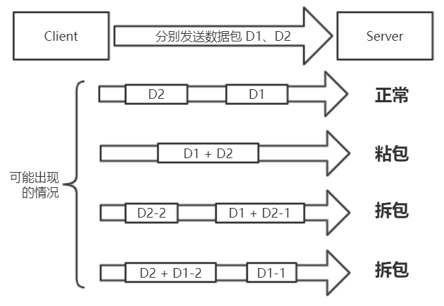

## TCP 粘包/拆包

熟悉 TCP 编程 的都知道，无论是服务端还是客户端，当我们读取或者发送消息的时候，都需要考虑 TCP 底层 的 粘包/拆包机制。TCP 粘包/拆包问题，在功能测试时往往不会怎么出现，而一旦并发压力上来，或者发送大报文之后，就很容易出现 粘包 / 拆包问题。如果代码没有考虑，往往就会出现解码错位或者错误，导致程序不能正常工作。本篇博文，我们先简单了解 TCP 粘包/拆包 的基础知识，然后来看看 Netty 是如何解决这个问题的。

### TCP 粘包/拆包问题说明

TCP 是个 “流” 协议，所谓流，就是没有界限的一串数据。TCP 底层 并不了解上层（如 HTTP 协议）业务数据的具体含义，它会根据 TCP 缓冲区 的实际情况进行包的划分，所以在业务上认为，一个完整的包可能会被 TCP 拆分成多个包进行发送，也有可能把多个小的包封装成一个大的数据包发送，这就是所谓的 TCP 粘包和拆包问题。我们可以通过下面的示例图，对 TCP 粘包和拆包问题 进行说明。



假设客户端依次发送了两个数据包 DI 和 D2 给服务端，由于服务端一次读取到的字节数是不确定的，故可能存在以下 4 种情况。

1. 服务端分两次读取到了两个独立的数据包，分别是 D1 和 D2，没有粘包和拆包；
2. 服务端一次接收到了两个数据包，DI 和 D2 粘合在一起，被称为 TCP 粘包；
3. 服务端分两次读取到了两个数据包，第一次读取到了完整的 DI 包 和 D2 包的部分内容，第二次读取到了 D2 包 的剩余内容，这被称为 TCP 拆包；
4. 服务端分两次读取到了两个数据包，第一次读取到了 D1 包的部分内容，第二次读取到了 D1 包的剩余内容 和 D2 包的整包。

如果此时服务端 TCP 接收滑窗非常小，而 数据包 DI 和 D2 比较大，很有可能会发生第 5 种可能，即服务端分多次才能将 D1 和 D2 包 接收完全，期间发生多次拆包。

### TCP 粘包/拆包发生的原因

问题产生的原因有三个，分别如下。

1. **应用程序 write 写入的字节大小 超出了 套接口发送缓冲区大小；**
2. 进行 MSS 大小的 TCP 分段；
3. 以太网帧的 payload 大于 MTU 进行 IP 分片。

### 粘拆包问题的解决策略

由于底层的 TCP 无法理解上层的业务数据，所以在底层是无法保证数据包不被拆分和重组的，这个问题只能通过上层的应用协议栈设计来解决，根据业界的主流协议的解决方案，可以归纳如下。

1. 固定消息长度，例如，每个报文的大小为 固定长度 200 字节，如果不够，空位补空格；
2. 在包尾使用 “回车换行符” 等特殊字符，作为消息结束的标志，例如 FTP 协议，这种方式在文本协议中应用比较广泛；
3. 将消息分为消息头和消息体，在消息头中定义一个 长度字段 Len 来标识消息的总长度;
4. 更复杂的应用层协议。

介绍完了 TCP 粘包/拆包 的基础，下面我们来看看 Netty 是如何使用一系列 “半包解码器” 来解决 TCP 粘包/拆包问题的。

## 利用 Netty 的解码器 解决 TCP 粘拆包问题

根据上面的 粘拆包问题解决策略，Netty 提供了相应的解码器实现。有了这些解码器，用户不需要自己对读取的报文进行人工解码，也不需要考虑 TCP 的粘包和拆包。

### LineBasedFrameDecoder 和 StringDecoder 的原理分析

为了解决 TCP 粘包 / 拆包 导致的 半包读写问题，Netty 默认提供了多种编解码器用于处理半包，只要能熟练掌握这些类库的使用，TCP 粘拆包问题 从此会变得非常容易，你甚至不需要关心它们，这也是其他 NIO 框架 和 JDK 原生的 NIO API 所无法匹敌的。对于使用者来说，只要将支持半包解码的 Handler 添加到 ChannelPipeline 对象 中即可，不需要写额外的代码，使用起来非常简单。

```java
    // 示例代码，其中 socketChannel 是一个 SocketChannel对象
    socketChannel.pipeline().addLast( new LineBasedFrameDecoder(1024) );
    socketChannel.pipeline().addLast( new StringDecoder() );
```

LineBasedFrameDecoder 的工作原理是它依次遍历 ByteBuf 中的可读字节，判断看是否有 “\n” 或者 “\r\n”，如果有，就以此位置为结束位置，从可读索引到结束位置区间的字节就组成了一行。它是以换行符为结束标志的解码器，支持携带结束符或者不携带结束符两种解码方式，同时支持配置单行的最大长度。如果连续读取到最大长度后仍然没有发现换行符，就会抛出异常，同时忽略掉之前读到的异常码流。

StringDecoder 的功能非常简单，就是将接收到的对象转换成字符串，然后继续调用后面的 Handler。LineBasedFrameDecoder + StringDecoder 组合 就是按行切换的文本解码器，它被设计用来支持 TCP 的粘包和拆包。

### 其它解码器

除了 LineBasedFrameDecoder 以外，还有两个常用的解码器 DelimiterBasedFrameDecoder 和 FixedLengthFrameDecoder，前者能自动对 “以分隔符做结束标志的消息” 进行解码，后者可以自动完成对定长消息的解码。使用方法也和前面的示例代码相同，结合 字符串解码器 StringDecoder，轻松完成对很多消息的自动解码。
