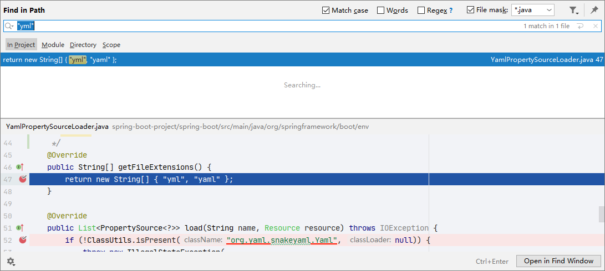
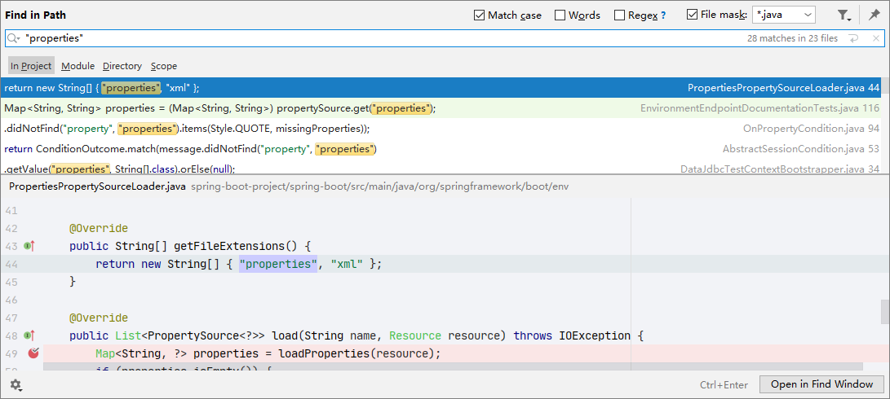
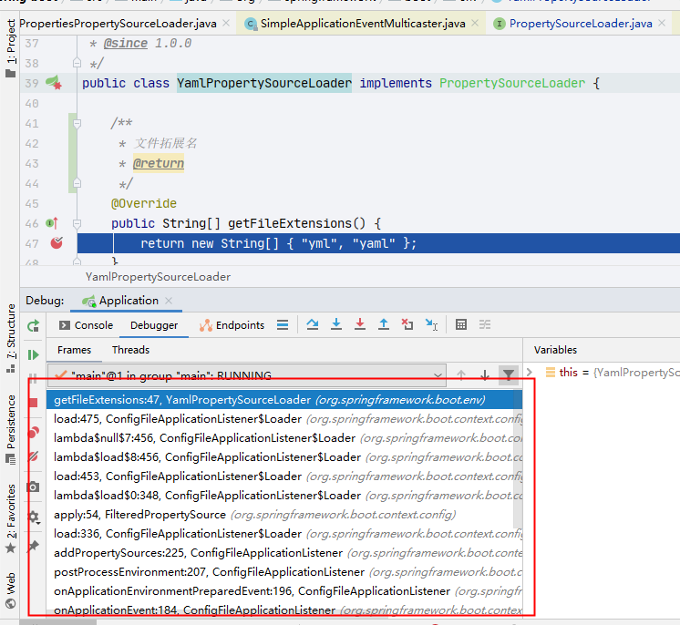
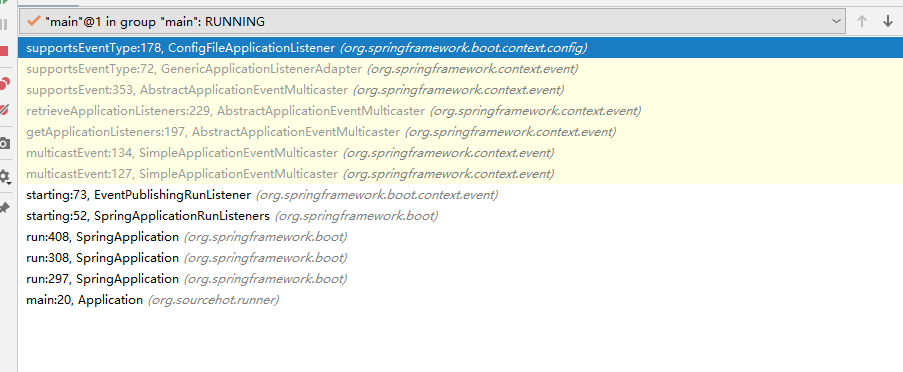
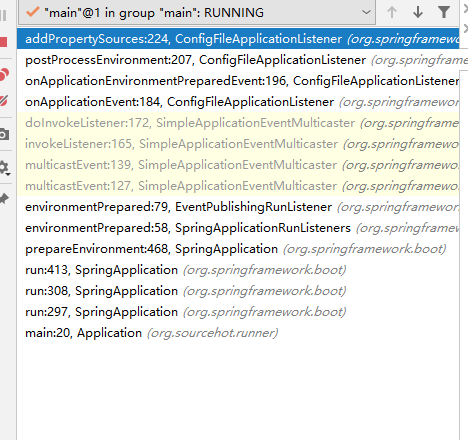
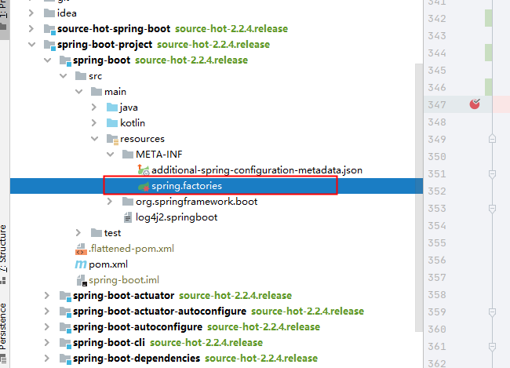
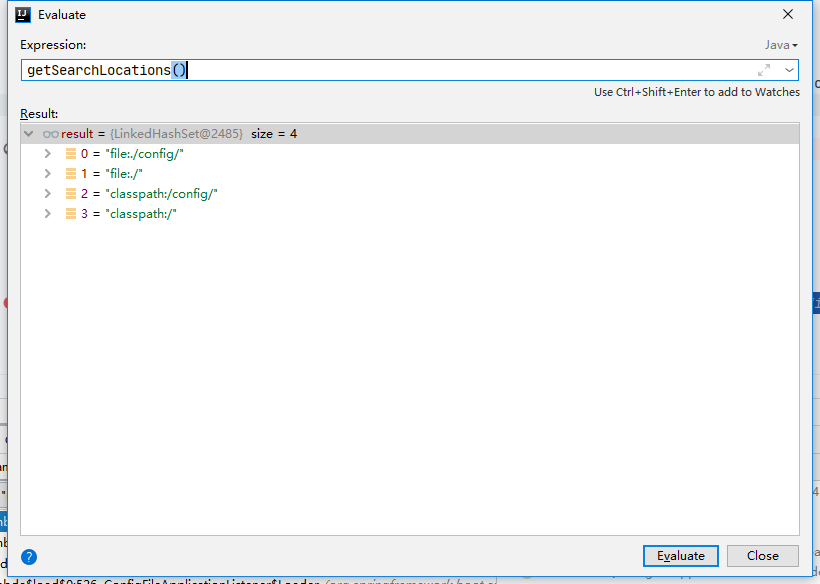
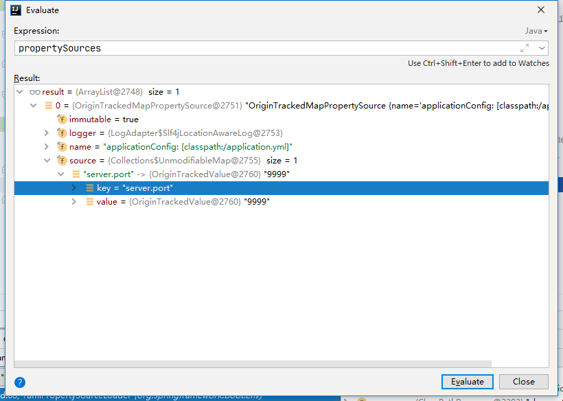

# Spring Boot application 文件加载

- Author: [HuiFer](https://github.com/huifer)
- 源码阅读仓库: [SourceHot-spring-boot](https://github.com/SourceHot/spring-boot-read)

## 如何找到这个加载的过程

1. 创建配置文件`application.yml`

2. 全局搜索 yml

   

3. 换成`properties`搜索

   

4. 我们以`yml`为例打上断点开始源码追踪

看到调用堆栈



- 一步一步回上去看如何调用具体方法的

## ConfigFileApplicationListener

- 配置文件监听器

### 调用过程





`org.springframework.boot.context.config.ConfigFileApplicationListener#addPropertySources`

```java
protected void addPropertySources(ConfigurableEnvironment environment, ResourceLoader resourceLoader) {
		RandomValuePropertySource.addToEnvironment(environment);
		// 加载器加载信息
		new Loader(environment, resourceLoader).load();
	}
```

### Loader

- 配置资源加载器

构造方法

```java
		Loader(ConfigurableEnvironment environment, ResourceLoader resourceLoader) {
		    // 环境配置
			this.environment = environment;
			// 占位符处理器
			this.placeholdersResolver = new PropertySourcesPlaceholdersResolver(this.environment);
			// 资源加载器
			this.resourceLoader = (resourceLoader != null) ? resourceLoader : new DefaultResourceLoader();
			// 配置信息加载器初始化
			this.propertySourceLoaders = SpringFactoriesLoader.loadFactories(PropertySourceLoader.class,
					getClass().getClassLoader());
		}

```

- 熟悉的老朋友`this.propertySourceLoaders = SpringFactoriesLoader.loadFactories(PropertySourceLoader.class, getClass().getClassLoader())`， 看看**`spring.factories`**有什么

  - 搜索目标: `org.springframework.boot.env.PropertySourceLoader`

    


观察发现里面有一个`YamlPropertySourceLoader`和我们之前找 yml 字符串的时候找到的类是一样的。说明搜索方式没有什么问题。


初始化完成，后续进行解析了

### load 方法

```java
		void load() {
			FilteredPropertySource.apply(this.environment, DEFAULT_PROPERTIES, LOAD_FILTERED_PROPERTY,
					(defaultProperties) -> {
						this.profiles = new LinkedList<>();
						this.processedProfiles = new LinkedList<>();
						this.activatedProfiles = false;
						this.loaded = new LinkedHashMap<>();
						// 初始化配置文件
						initializeProfiles();
						while (!this.profiles.isEmpty()) {
							Profile profile = this.profiles.poll();
							if (isDefaultProfile(profile)) {
								addProfileToEnvironment(profile.getName());
							}
							load(profile, this::getPositiveProfileFilter,
									addToLoaded(MutablePropertySources::addLast, false));
							this.processedProfiles.add(profile);
						}
						load(null, this::getNegativeProfileFilter, addToLoaded(MutablePropertySources::addFirst, true));
						addLoadedPropertySources();
						applyActiveProfiles(defaultProperties);
					});
		}

```

### initializeProfiles

- 初始化`private Deque<Profile> profiles;` 属性
- 

### load

- `org.springframework.boot.context.config.ConfigFileApplicationListener.Loader#load(org.springframework.boot.context.config.ConfigFileApplicationListener.Profile, org.springframework.boot.context.config.ConfigFileApplicationListener.DocumentFilterFactory, org.springframework.boot.context.config.ConfigFileApplicationListener.DocumentConsumer)`

```JAVA
private void load(Profile profile, DocumentFilterFactory filterFactory, DocumentConsumer consumer) {
			getSearchLocations().forEach(
					// 本地路径
					(location) -> {
						// 是不是文件夹
						boolean isFolder = location.endsWith("/");
						// 文件名,默认application
						Set<String> names = isFolder ? getSearchNames() : NO_SEARCH_NAMES;
						// 循环加载
						names.forEach((name) -> {
							load(location, name, profile, filterFactory, consumer);
						});
					});
		}
```

- 资源路径可能性



该方法采用循环每个路径下面都去尝试一遍

- 中间过程省略，我们直接看最后的加载行为
  - `org.springframework.boot.context.config.ConfigFileApplicationListener.Loader#loadDocuments`

```java
		private List<Document> loadDocuments(PropertySourceLoader loader, String name, Resource resource)
				throws IOException {
		    // 文档的缓存key
			DocumentsCacheKey cacheKey = new DocumentsCacheKey(loader, resource);
			// 文档信息
			List<Document> documents = this.loadDocumentsCache.get(cacheKey);
			if (documents == null) {
				// 执行加载，将配置文件读取返回
				List<PropertySource<?>> loaded = loader.load(name, resource);
				// 数据转换
				documents = asDocuments(loaded);
				// 缓存设置
				this.loadDocumentsCache.put(cacheKey, documents);
			}
			return documents;
		}

```

此处的`loader.load()`调用具体的 loader 实现类进行执行方法

### yml 解析

```java
	@Override
	public List<PropertySource<?>> load(String name, Resource resource) throws IOException {
		if (!ClassUtils.isPresent("org.yaml.snakeyaml.Yaml", null)) {
			throw new IllegalStateException(
					"Attempted to load " + name + " but snakeyaml was not found on the classpath");
		}
		// 将资源转换成集合对象
		List<Map<String, Object>> loaded = new OriginTrackedYamlLoader(resource).load();
		if (loaded.isEmpty()) {
			return Collections.emptyList();
		}
		List<PropertySource<?>> propertySources = new ArrayList<>(loaded.size());
		for (int i = 0; i < loaded.size(); i++) {
			String documentNumber = (loaded.size() != 1) ? " (document #" + i + ")" : "";
			// 放入返回结果中
			propertySources.add(new OriginTrackedMapPropertySource(name + documentNumber,
					Collections.unmodifiableMap(loaded.get(i)), true));
		}
		return propertySources;
	}

```



- `PropertiesPropertySourceLoader`解析同理不在次展开描述了

### asDocuments

```JAVA
		/**
		 * 将 {@link PropertySource} 转换成 {@link Document}
		 * @param loaded
		 * @return
		 */
		private List<Document> asDocuments(List<PropertySource<?>> loaded) {
			if (loaded == null) {
				return Collections.emptyList();
			}
			return loaded.stream().map(
					// 循环创建新对象
					(propertySource) -> {
						// 对象创建
						Binder binder = new Binder(ConfigurationPropertySources.from(propertySource),
								this.placeholdersResolver);
						/**
						 * 通过 {@link Binder} 将数据进行绑定，创建 {@link Document}进行返回
						 */
						return new Document(propertySource, binder.bind("spring.profiles", STRING_ARRAY).orElse(null),
								getProfiles(binder, ACTIVE_PROFILES_PROPERTY),
								getProfiles(binder, INCLUDE_PROFILES_PROPERTY));
					}).collect(Collectors.toList());
		}

```

---
